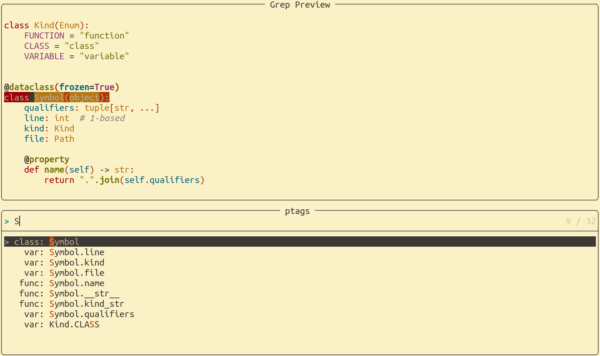

ptags - jump to any python symbol
=================================

Most useful as an `nvim` plugin with `telescope`: fuzzy-matched,
fully-qualified navigation goodness, complementing your LSP experience.

Similar to `ctags`, and can be used as a drop-in replacment, but most
notably includes fully qualified symbols.

But why?
--------

`nvim` with LSP support is awesome. Unfortunately, at the time of
writing, LSPs like `pyright` or `jedi`, and based on my experience, many
LSPs report workspace symbols non-fully-qualified.

Consider you have twice the same class name in two different namespaces:

``` {.python}
pipe.hitter.FrogMan
out.performer.FrogMan
```

With non-fully-qualified search, it is cumbersome to navigate to the
right place. Most LSPs will have two entries called `FrogMan`. Instead,
`ptags` lets you search fuzzy for the fully qualified Name, you might
type `pipe FrogMan` and get the right result to jump to. You might also
type `FrogMan`, realize it is ambiguous, and expand to `FrogMan pipe`
and get the right result to jump to.

Note in particular, jumping to a symbol that is under your cursor is not
for `ptags`, LSPs do that just fine. Use `ptags` if you want to navigate
to a symbol up-front by naming it ... because sometimes you just know
where you need to be.



install
-------

### nvim

Prerequisites:

-   `nvim` with `telescope`
-   `zsh`
-   `python3.10`

On a modern ubuntu `sudo apt install zsh python3.10` should work.
Otherwise see https://launchpad.net/\~deadsnakes/+archive/ubuntu/ppa for
installing newer pythons on an older ubuntu.

For the purists, with `nvim`'s excellent package support
(`:help packages`), do the following and adapt paths accordingly:

``` {.zsh}
cd ~/.config/nvim/pack/plugins/opt
git clone --recurse-submodules https://github.com/dkuettel/ptags.nvim.git
cd ptags.nvim
./setup
```

Alternatively, put it in `~/.config/nvim/pack/plugins/start` if you want
it to be loaded automatically.

Running `setup` prepares the python virtual environment. Rerun it when
you `git pull` to update to changed python dependencies (see
`python/requirements.in`). If you use any nvim plugin manager, then
`setup` is your install hook.

Then in your vim lua configuration, to get going:

``` {.lua}
vim.cmd("packadd ptags.nvim")  -- packadd is not needed, if you put it into the "start" folder instead of "opt" above
local ptags = require("ptags")
```

The lua interface to `ptags` only offers one entry point:
`ptags.telescope({"python", "src", "test.py"})` to start telescope and
fuzzy-match plus jump. Pass a table of folders and files you want to
search in. Paths are relative to the working directory of the current
`nvim` instance. It cannot be empty. An additional argument
`ptags.telescope(..., opts)` is passed on to `telescope` for additional
`telescope` options.

As a starting point, consider:

``` {.lua}
vim.cmd("packadd ptags.nvim")
local ptags = require("ptags")

local function ptags_local()
    ptags.telescope { vim.fn.expand("%") }
end

local function ptags_workspace()
    local sources = {
        vim.fn.glob("python", false, true) or { "." },
        vim.fn.glob("libs/*/python", false, true),
    }
    sources = vim.tbl_flatten(sources)
    ptags.telescope(sources)
end

vim.keymap.set("n", ",.", ptags_local, { buffer = bufnr, desc = "ptags local symbols" })
vim.keymap.set("n", ",,", ptags_workspace, { buffer = bufnr, desc = "ptags workspace symbols" })
```

This maps `,,` to look for symbols in the workspace, and `,.` to only
look for symbols in the current file. If you use `lspconfig` you might
want to do this in your `mappings` passed to `lspconfig` only when
working with python files. This way, non-python projects will do `,,`
for global symbol search based on whatever LSP is running, while on
python projects `,,` will instead use `ptags` with fully qualified
names.

It is up to you how to conditionally setup `ptags` or not in different
`nvim` configurations.

standalone
==========

Same dependencies and steps as for `nvim`:

``` {.zsh}
sudo apt install zsh python3.10
cd ~/.config/nvim/pack/plugins/opt
git clone --recurse-submodules https://github.com/dkuettel/ptags.nvim.git
cd ptags.nvim
./setup
```

Then `bin/ptags` behaves similar to `ctags`. Try
`ptags --format=human python/ptags.py` for an example output. Try
`ptags --format=ctags python/ptags.py` for ctags-like output.

You can add `bin` to your `$PATH`, or symlink `bin/ptags` into `$PATH`.
However, note that for `nvim`-use only, it is not required to have it in
your `$PATH`.
