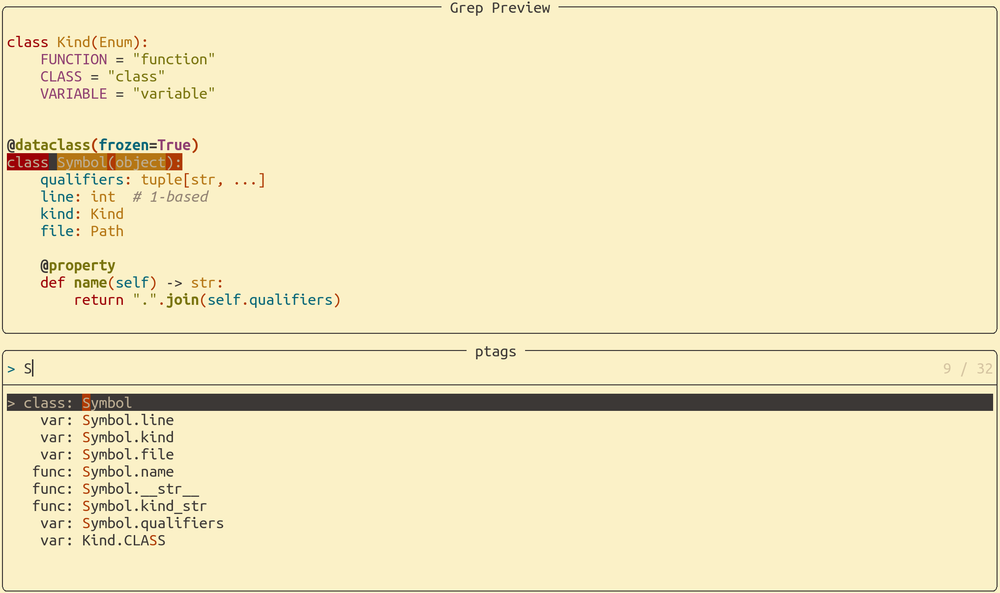

# ptags - jump to any python symbol

Most useful as an `nvim` plugin with `telescope`: fuzzy-matched,
fully-qualified navigation goodness, complementing your LSP experience.

Similar to `ctags`, and can be used as a drop-in replacement, but most
notably includes fully qualified symbols.

## But why?

`nvim` with LSP support is awesome. Unfortunately, at the time of
writing, LSPs like `pyright` or `jedi`, and based on my experience, many
other LSPs report workspace symbols non-fully-qualified.

Consider you have twice the same class name in two different namespaces:

``` python
pipe.hitter.FrogMan
out.performer.FrogMan
```

With non-fully-qualified search, it is cumbersome to navigate to the
right place. Most LSPs will have two entries called `FrogMan`. Instead,
`ptags` lets you search fuzzy for the fully qualified Name, you might
type `pipe FrogMan` and get the right result to jump to. You might also
type `FrogMan`, realize it is ambiguous, and expand to `FrogMan pipe`
and get the right result to jump to.

Note in particular, jumping to a symbol that is under your cursor is not
`ptags`'s business, LSPs do that just fine. Use `ptags` if you want to
navigate to a symbol up-front by naming it ... because sometimes you
just know where you need to be.



## install

### the plugin

The `nvim` plugin part has no `setup` method. You manage your vim
bindings yourself to call `ptags`. As an example:

``` lua
local ptags = require("ptags")

local function ptags_local()
    ptags.telescope({ vim.fn.expand("%") })
end

local function ptags_workspace()
    local sources = {
        vim.fn.glob("python", false, true),
        vim.fn.glob("src", false, true),
        vim.fn.glob("libs/*/python", false, true),
    }
    sources = vim.tbl_flatten(sources)
    if #sources == 0 then
        sources = { "." }
    end
    ptags.telescope(sources)
end

vim.keymap.set("n", "ge", ptags_local, { buffer = bufnr, desc = "ptags local symbols" })
vim.keymap.set("n", "gu", ptags_workspace, { buffer = bufnr, desc = "ptags workspace symbols" })
```

`ptags.telescope` expects a list of locations for sources. You have to
provide that. Further:

``` lua
---@param sources string[] Cannot be empty or nil.
---@param opts table Additional options for telescope.
---@param ptags string? The ptags executable to use, defaults to "ptags" anywhere in your $PATH.
local function telescope(sources, opts, ptags)
```

Note especially the last `ptags` argument. Depending on your setup, you
have to provide that argument.

### the executable

It's easiest to make the `ptags` executable available on your `$PATH`.
By default that's where the plugins looks for it. But you are free to do
it anyway you want, as long as you tell the plugin how to find it.

If you use nixos or nixpkgs, the flake's default package builds the
executable for you; done.

Otherwise, it's a standard `pyproject.toml` python project using `uv`.
You could make a wrapper around `uv run`, or probably `pipx` works too.
You need python `3.13`.

The executable can be used standalone, without the plugin. Then `ptags`
behaves similar to `ctags`. Try `ptags --format=human python/ptags.py`
for an example output. Try `ptags --format=ctags python/ptags.py` for
ctags-like output.
